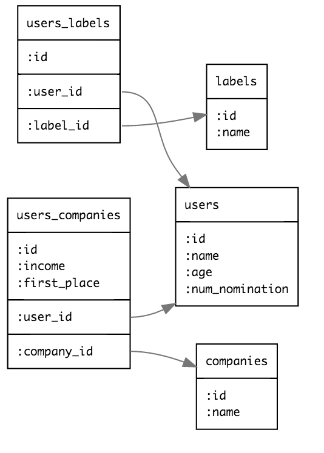

[転職ドラフト｜ITエンジニアを年収・仕事内容つきで競争入札](https://job-draft.jp/) の情報を sqlite3 に入れるコード。

```
bundle
bundle exec ruby ./fetch_users.rb
```

ここで手作業。
`job-draft.jp` は、ページネーションが不安定ソート(?)なので、
同じURLにアクセスしても、表示されるユーザーは異なることがある。

行をカウントして、232 であることを確認する。

```
wc -l job-draft-users.csv
# => 232
```

もし違うなら、リトライ回数を増やすとか、ページを調節するとかが必要。

```
bundle exec ruby ./fetch_users_info.rb
bundle exec ruby ./convert_csv_to_sqlite3.rb
```

以上で、`./job-draft.sqlite3` にデータが格納される。

# ERD
[rails-erd](https://github.com/voormedia/rails-erd) はrails 限定なので、他に探したらあった。
- http://www.dbvis.com/
- https://github.com/sualeh/SchemaCrawler/releases/

が希望には沿わなかったので、
[guiflow](https://github.com/hirokidaichi/guiflow/releases/tag/v_0.1.1)を使って自分で書いた。



# sqlite3

db の構成が思い描ければ、one-liner で出力できるので、扱いは難しくない。

```
sqlite3 -separator '|' -header job-draft.sqlite3 "select age, count(*) from users group by age"
```

面倒なら、プログラムを書いたほうが早い。

